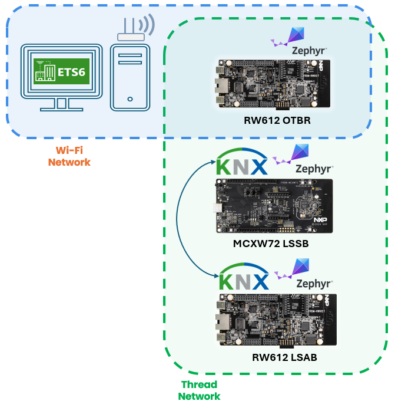
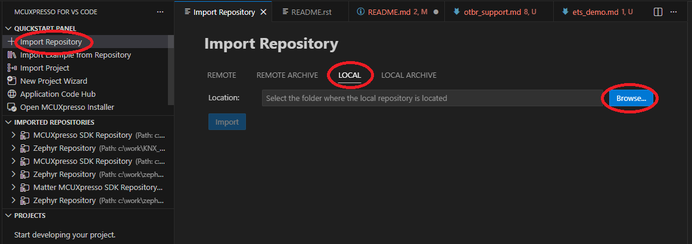
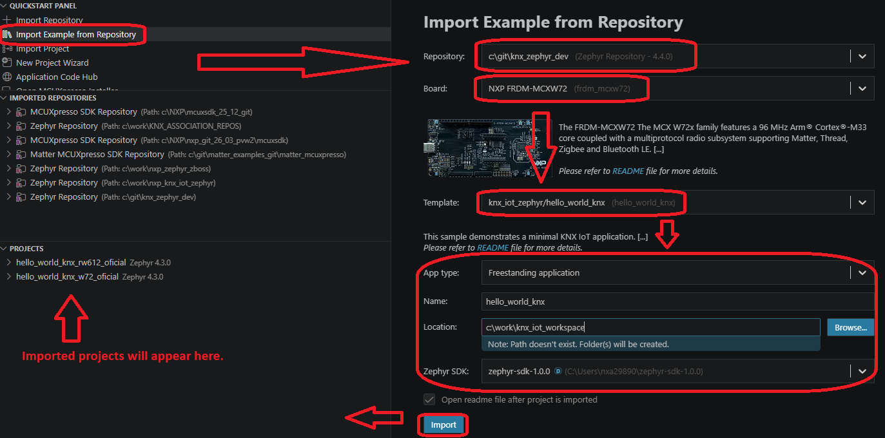
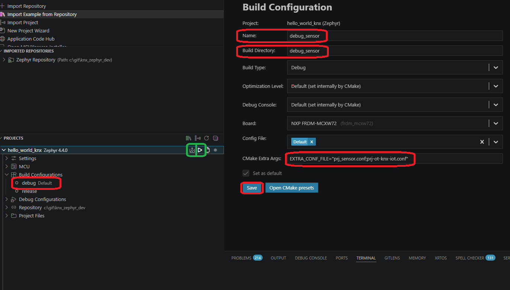

# Zephyr RTOS support for KNX IoT Point API Stack

[](https://www.nxp.com)

## Overview

This repository provides examples and guidance for developing KNX IoT applications using the Zephyr RTOS on various connectivity microcontroller platforms. These examples demonstrate how to build KNX IoT devices that can be configured and managed using the KNX Association's Engineering Tool Software (ETS).

### What's Included

- **KNX IoT Application examples**
   - **Light Switched Sensor Basic (LSSB)** - Example sensor application
   - **Light Switched Actuator Basic (LSAB)** - Example actuator application
- **Zephyr OpenThread Border Router (OTBR) support** - Wi-Fi and Ethernet configurations for network connectivity
- **VS Code Integration** - Build and debug using MCUXpresso for VS Code extension
- **Cross-platform development support** - Works on Windows and Linux

### Key Features

- ✅ Full KNX IoT Point API stack implementation
- ✅ Compatibility with KNX Association's ETS (Engineering Tool Software) tool
- ✅ OpenThread mesh networking support
- ✅ Zephyr-based real-time operation
- ✅ Debug and Release build configurations
- ✅ J-Link debugging support



## Repository Structure

```
<root>
├── docs/                        # Documentation folder
└── hello_world_knx/             # Basic Light Switched application configurable as Light Switched Actuator Basic (LSAB) or Light Switched Sensor Basic (LSSB)
```

## Table of Contents

1. [Software](#software)
2. [Hardware](#hardware)
3. [Getting Started](#getting-started)
4. [Available application examples](#available-examples)
5. [Running the ETS6 demo](#ets-demo)
6. [Troubleshooting](#troubleshooting)
7. [Support](#support)
8. [Release Notes](#release-notes)

## Software Requirements<a name="software"></a>

- [ ] **Zephyr SDK** (version 0.16.0 or later)
- [ ] **West** (Zephyr's meta-tool)
- [ ] **CMake** (minimum version 3.20.0)
- [ ] **Python** 3.8 or later
- [ ] **Git**
- [ ] KNX Association's **ETS6 software** (for device commissioning and configuration)
- [ ] **MCUXpresso for VS Code** (`NXPSemiconductors.mcuxpresso`) - VS Code extension for NXP processors
- [ ] **Secure Provisioning SDK tool** - For device provisioning and security setup

## Hardware<a name="hardware"></a>

### Supported Boards

#### OpenThread enablement

- **[FRDM-RW612](https://docs.zephyrproject.org/latest/boards/nxp/frdm_rw612/doc/index.html)** - FRDM Development Board for NXP RW612 Wi-Fi 6 + Bluetooth Low Energy + 802.15.4 Tri-Radio Wireless MCU.
- **[FRDM-MCXW72](https://docs.zephyrproject.org/latest/boards/nxp/frdm_mcxw72/doc/index.html)** - FRDM Development Board for NXP MCXW72 Bluetooth LE, Channel Sounding and IEEE802.15.4 Wireless MCU.

OpenThread enablement requires OpenThread Border Router (OTBR) setup. Setting up the build environment, building and flashing Zephyr OTBR are described [here](docs/otbr_support.md).

### Additional Hardware

- **Wi-Fi Access Point** - For Wi-Fi network support
- **FRDM-RW612 for OpenThread Border Router** - For Thread network support and OTBR functionality to Wi-Fi/Ethernet
- **USB Cable** - For board power and serial communication
- **Ethernet Cable** (Optional) - For Ethernet OTBR variant

## Getting started<a name="getting-started"></a>

### Environment setup

The generic Zephyr development setup is required to build and flash applications. Please refer to the [Zephyr Getting Started Guide](https://docs.zephyrproject.org/latest/getting_started/index.html) for detailed instructions.

For integration with VS Code, please refer to [NXP's Getting started with Zephyr guide](https://www.nxp.com/document/guide/getting-started-with-zephyr:GS-ZEPHYR).

### KNX IoT Zephyr application

To start developing, first please clone this repository.

```bash
git clone https://github.com/nxp-appcodehub/dm-knx-iot-zephyr-apps-with-ets-support-on-nxp-mcus
```

### Zephyr repository initialization

To initialize the Zephyr repository and KNX IoT Point API stack support, run the following commands:

```bash
cd <repo_root>
west init -l
west update
# To fetch binary blobs required by NXP wireless SoCs
west blobs fetch hal_nxp

# Tool required for secure provisioning and writing MCXW72 NBU
pip install spsdk
```

### VS Code integration

The repository can be imported in VS Code using `MCUXpresso for VS Code` extension. The extension provides integrated build, flash, and debug capabilities for supported boards.
The extension can be found in the `Extensions` panel in VS Code.

Using the extension, click on `Import Repository`, select `Local` tab and browse for the repository folder.



To import a KNX IoT Zephyr application example, click on the `Import Examples from Repository` and in the newly opened windows, select previously imported repository. Then select the board from the `Boards` dropdown, select the KNX IoT application template (for example `hello_world_knx`) from the `Template` dropdown. Select how to import the project (`App type` dropdown, with options such as `Repository`, `Freestanding` or `Workspace`), set the name of the imported project and the location (in case of `Freestanding` or `Workspace` import types), select the `Zephyr SDK` (recommended `zephyr-sdk-1.0.0`) and click `Import`.



The imported project will appear in the `Projects` panel and can be built, flashed, and debugged using the extension's integrated tools.

To build the application with a specific configuration for the imported project, in the `Projects` panel, in the `Build Configurations` dropdown, select the desired configuration (for example, `debug`) and click on the `Edit` button.
The example in the following image showcase how to configure the application as a light switched sensor (LSSB). The name of the configuration can be edited (for example, `debug_sensor`), as well as the `Build Directory`. To edit the configuration for sensor, in the `CMake Extra Args` field, add `EXTRA_CONF_FILE="prj_sensor.conf;prj-ot-knx-iot.conf"`. Save the configuration.

To build the application, click on the `Build Project` button in the `Projects` panel. To debug the application, click the `Debug` button in the `Projects` panel. This is highlighted with green color in the next image.



## Available application examples<a name="available-examples"></a>

Each available application folder contains instructions on the required setup and build steps. Please refer to the respective application's README.md for detailed guidance.

- [hello_world_knx](hello_world_knx/README.rst) - Basic Light Switched application with KNX IoT Point API stack integration

## Running the ETS6 demo<a name="ets-demo"></a>

The guide to exercise the ETS6 demo can be found [here](docs/ets_demo.md).

## Troubleshooting<a name="troubleshooting"></a>

**Problem:** `SSL certificate problem: self-signed certificate in certificate chain`
When running `west update`, you may encounter SSL certificate errors. To resolve, please enter:
```bash
git config --global http.sslVerify false
```

**Problem:** `west: command not found`
```bash
# Install west
pip3 install west
```

### Debug Issues

**Problem:** J-Link cannot find device
- Check J-Link connections
- Verify board is powered
- Try specifying serial number explicitly
- Run `JLinkExe -ShowEmuList` to verify J-Link is detected

**Problem:** Debug session fails to start
- Ensure application is built first
- Verify `.elf` file exists in build output

**Problem:** Breakpoints not working
- Ensure you're building in Debug mode (not Release)
- Check that optimization is not too aggressive
- Verify source file paths match

**Problem:** Main application is not starting or hangs when running on MCXW72
- Ensure that the NBU binary has been written, more details can be found [here](https://docs.zephyrproject.org/latest/boards/nxp/frdm_mcxw72/doc/index.html#nbu-flashing).

### Runtime Issues

**Problem:** Application doesn't start
- Check serial console output
- Verify correct binary was flashed
- Try erasing flash completely: `JLinkExe` → `erase` → `exit`

**Problem:** Network connectivity issues
- Verify Thread network configuration
- Check OTBR is running and configured
- Ensure firewall allows CoAP traffic (UDP port 5683)

## Support<a name="support"></a>

### Getting Help

If you encounter issues:

1. Check the [Troubleshooting](#troubleshooting) section
2. Review build/debug output for error messages
3. Consult the [KNX IoT Point API documentation](https://gitlab.knx.org/public-projects/knx-iot-point-api-stack)
4. Post questions on [NXP Community Forum](https://community.nxp.com/)

### Documentation

- [KNX IoT Welcome page](https://buildwithknxiot.knx.org/public-projects/knx-iot-docs)
- [KNX IoT Point API Stack](https://gitlab.knx.org/public-projects/knx-iot-point-api-stack)
- [OpenThread Documentation](https://openthread.io/)
- [NXP RW612 Documentation](https://www.nxp.com/products/wireless/wi-fi-plus-bluetooth-plus-802-15-4/wireless-mcu-with-integrated-tri-radiobr1x1-wi-fi-6-plus-bluetooth-low-energy-5-3-802-15-4:RW612)
- [NXP MCXW72 Documentation](https://www.nxp.com/products/MCX-W72)
- [Zephyr Documentation](https://docs.zephyrproject.org/latest/index.html)

### Community

- Reach out to [NXP Wireless Community Forum](https://community.nxp.com/t5/Wireless-MCU/bd-p/wireless-connectivity)
- [KNX Association](https://www.knx.org/)

### Project Metadata

<!----- Boards ----->
[]()

<!----- Categories ----->
[](https://mcuxpresso.nxp.com/appcodehub?category=wireless_connectivity)

<!----- Peripherals ----->
[](https://mcuxpresso.nxp.com/appcodehub?peripheral=802154)
[](https://mcuxpresso.nxp.com/appcodehub?peripheral=gpio)
[](https://mcuxpresso.nxp.com/appcodehub?peripheral=uart)

<!----- Toolchains ----->
[](https://mcuxpresso.nxp.com/appcodehub?toolchain=vscode)
[](https://mcuxpresso.nxp.com/appcodehub?toolchain=gcc)

Questions regarding the content/correctness of this example can be entered as Issues within this GitHub repository.

>**Warning**: For more general technical questions regarding NXP Microcontrollers and the difference in expected functionality, enter your questions on the [NXP Community Forum](https://community.nxp.com/)

[](https://www.youtube.com/NXP_Semiconductors)
[](https://www.linkedin.com/company/nxp-semiconductors)
[](https://www.facebook.com/nxpsemi/)
[](https://x.com/NXP)

## Release Notes <a name="release-notes"></a>

| Version | Description / Update                           | Date                        |
|:-------:|------------------------------------------------|----------------------------:|
| 1.0     | Initial release on Application Code Hub        | April 28<sup>th</sup> 2026 |

## Licensing

This project is licensed under the Apache License Version 2.0. See individual source files for specific license information.

## Origin

This project uses the following open-source components:

- **KNX IoT Point API Stack** - Apache License Version 2.0
- **OpenThread** - BSD-3-Clause License
- **Zephyr RTOS** - Apache License Version 2.0

See `LICENSE` file and individual component directories for detailed license information.
