# KNX IoT demo with ETS6 support

The following KNX IoT topology will be exercised in this guide:

- one board for the light sensor application.
- one board for the light actuator application.
- one board for the OpenThread Border router application
- one Wi-Fi Access Point

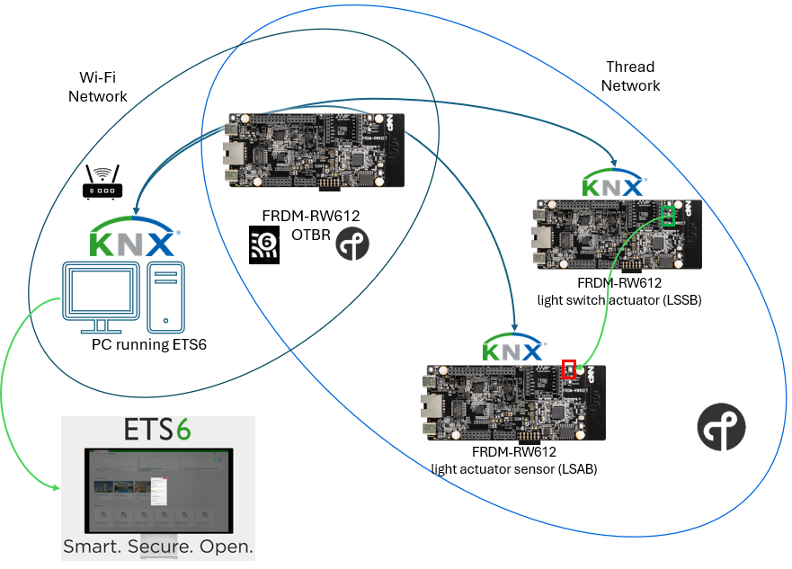

The image above is for reference.

## ETS install and KNX IoT device offline configuration

ETS6 software is required to be installed in order to commission and configure the KNX IoT devices.
The demo license is enough to exercise a low number of devices and it is enough for two devices. The software can be downloaded from [this location](https://my.knx.org/en/shop/ets).

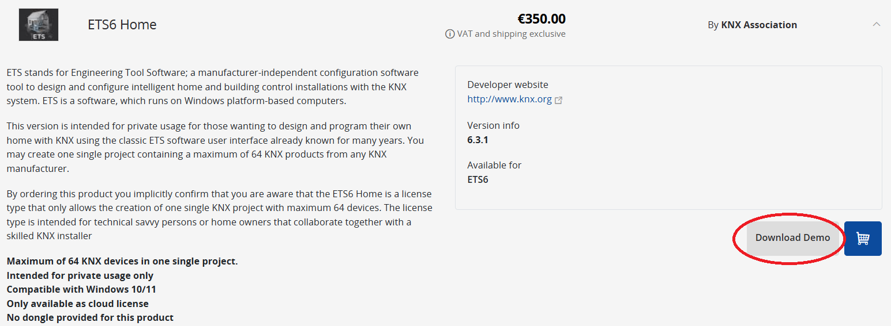

After installation, open the installed ETS application and click on `New Project`. Follow the steps to create a new ETS project.

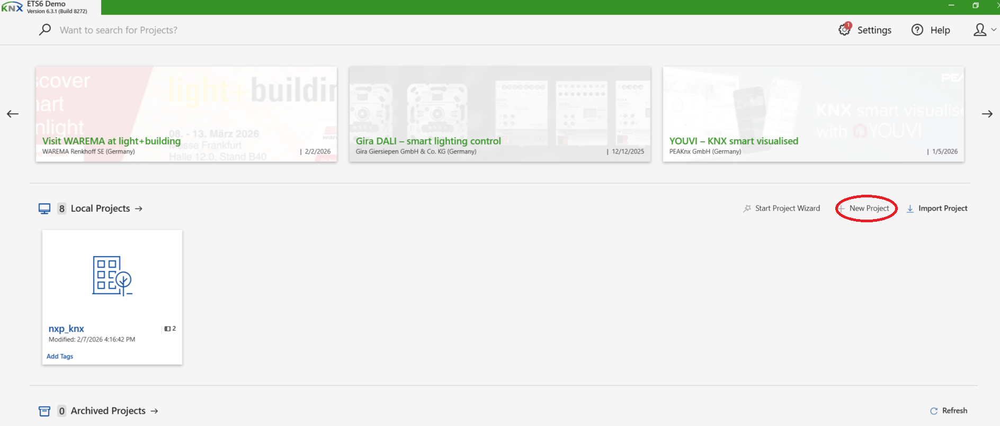

In the newly opened project, go to `Topology` panel by pressing the `+` icon from the upper part of the window.

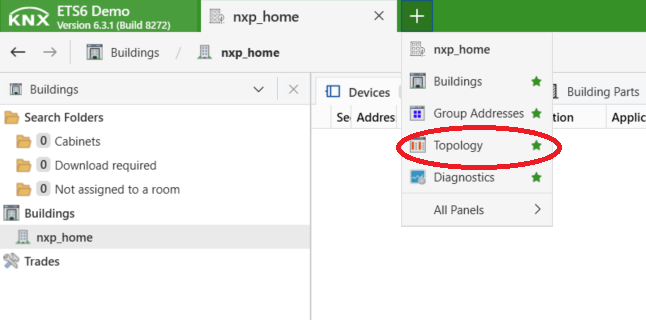

In the `Topology Backbone` panel on the left side, right click on `IP area`, go to `Add` and then click on `Lines`.

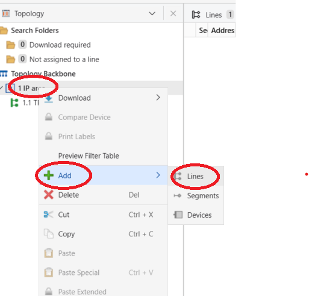

In the newly opened window, add an `IoT` line by selecting `IoT` Medium and give a name to the line.

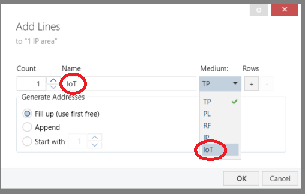

In the `Topology Backbone` panel on the left side, right click on the newly created `IoT` line, go to `Add` and then click on `Devices`. In the new `Device Catalog` panel opened in the lower part of the tool, search for `IoT` and select the `IoT Demo Sensor/Actuator` device entry. Drag the entry to the `IoT` line.

If the device entry is not available in the ETS catalog, you can import it from the KNX IoT Point API Stack repository. See the highlighted `Import` button from the `Device Catalog`. The path to the corresponding `*.knxprod` file is `<repo_root>/knx-iot-point-api-stack/apps/knx/ets`.

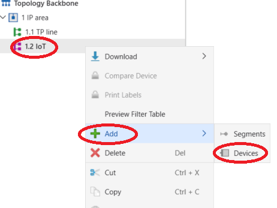

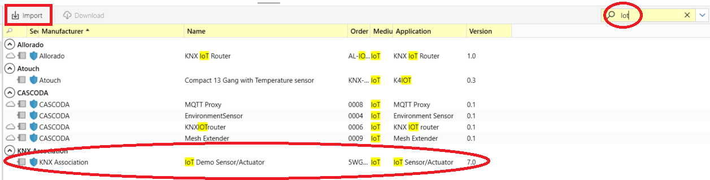

You will be prompted to add a password of your choosing to the ETS project.

A window for adding device certificate will appear.
Paste the device code taken from the CLI of the device. This can be obtained by opening a serial connection to the device (baud rate of `115200 bps`) and issuing `knx_iot qr` command.

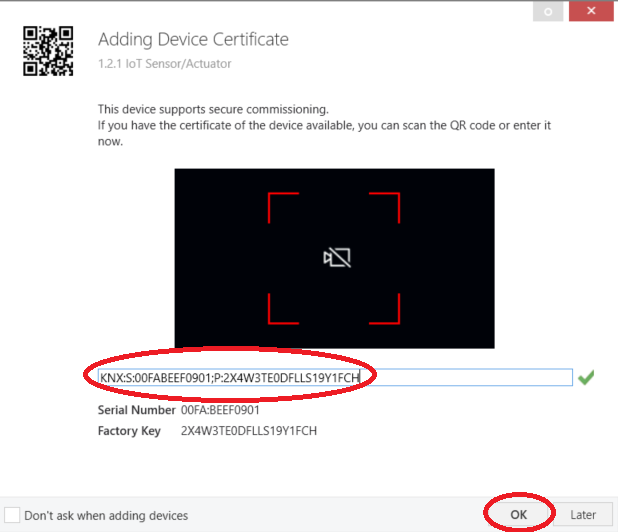

The default values for the applications in the repository are:
- Light switched actuator basic (LSAB): `KNX:S:00FABEEF0901;P:2X4W3TE0DFLLS19Y1FCH`
- Light switched sensor basic (LSSB): `KNX:S:00FABEEF0902;P:2X4W3TE0DFLLS19Y1FCH`

Repeat the steps for the other KNX IoT device.

Select each device and configure the product entry's actuator and sensor channels accordingly. See the table at the end of the document for correspondence of the device applications to their actuators and sensors, based on the used NXP platform.

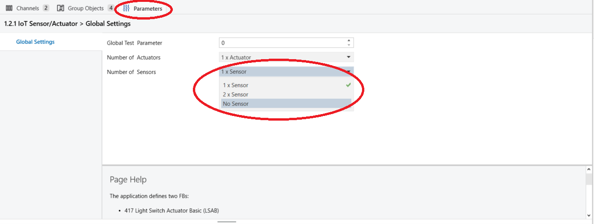

The final topology of the devices should resemble the configuration in the following figure.

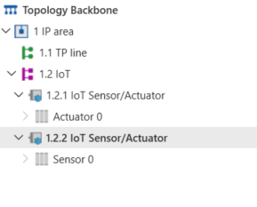

This concludes the offline configuration part from the ETS tool.

## KNX IoT device commissioning on Thread Network

The following steps require network connection between the PC running the ETS tool and the KNX IoT over Thread devices.

Assuming that the Thread network is up and running, configured as explained in [the OTBR guide](otbr_support.md), the KNX IoT over Thread devices need to be commissioned to the Thread network.

The Thread dataset can be obtained from the OTBR by issuing `ot dataset active -x` command in the CLI.

On the KNX IoT over Thread device, issue the following commands:

```bash
# To clear the storage on the device before the demo
knx_iot factoryreset
ot factoryreset

# Commission the device on Thread network
ot dataset set active 0e08000000000001000035060004001fffe00708fdb30c07690192f70c0402a0f7f802088f174af259ceb7f40510deadbeefdeadbeefdeadbeefdeadbeef01021212000300001a03084e58502d4f5442520410a27ef02769739692ecc9581becb2b5f2

# Start the interface
ot ifconfig up

# Start the Thread stack
ot thread start
```
Be advised that the hex dataset from above is just an example. The real value needs to be taken from the OTBR.

Check that the device is connected to the Thread network by issuing `ot state` command in the device's CLI. This command should return `child` or `router`, depending on the device's role in the Thread network.

Repeat the same steps to commission the second device.

## ETS device discovery and configuration download

The KNX IoT device's configuration needs to be downloaded from ETS. This implies that the OTBR needs to be up and running, connected to the backbone network (through Wi-Fi or Ethernet) and with the Thread network running. The KNX IoT over Thread devices need to be connected to the Thread network.

To check if the KNX IoT over Thread devices can be discovered from ETS, user can check if the `KNX IoT` interface is available in the `Bus interface` panel.

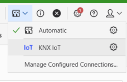

The configuration download can be started by either putting the corresponding device in `programming mode` or by starting the configuration download using the device's serial number.

### Download configuration using `programming mode`

To download the configuration to a device in `programming mode`, user needs to open the KNX IoT's device CLI and issue a `knx_iot pm set 1` command. This sets the device in `programming mode`, enabling configuration download. Alternatively, there is support for toggling `programming mode` on KNX IoT uncommissioned board by long pressing (longer than 1 second) a dedicated button on the device.

```bash
# To get application name
knx_iot name

KNX IoT application: KNX virtual sensor (LSSB)

# To get KNX IoT Commissioning QR code
knx_iot qr

=== QR Code: KNX:S:00FABEEF0901;P:2X4W3TE0DFLLS19Y1FCH ===

# To set `programming mode` to true
knx_iot pm set 1
# Or long press the dedicated button on the device for longer than 1 second
```

In ETS, in the `Topology Backbone` panel, right click on the device entry, select `Download` and `Download All`.

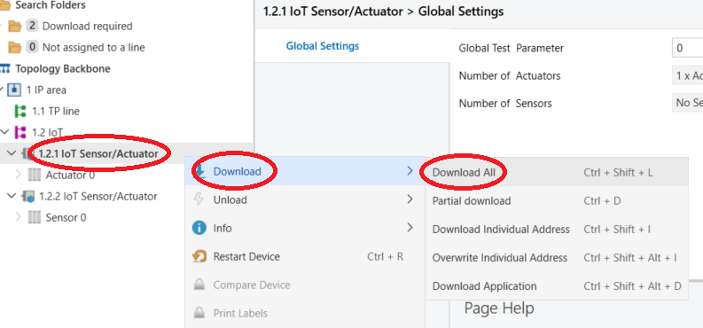

The process should start. Await until the process finishes.

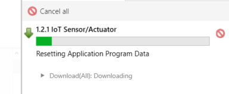

### Download configuration using `serial number`

Another method of configuration download is to use the serial number. To start this process, as previously explained, in ETS, in the `Topology Backbone` panel, right click on the device entry, select `Download` and `Download All`.

When ETS prompts to press the programming button, click on `Use Serial Number` as indicated in the figure.

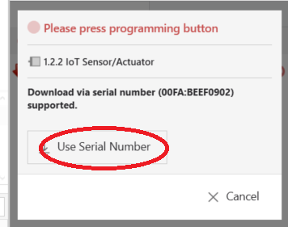

The process should start. Await until the process finishes.

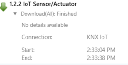

The KNX commissioning is completed upon reaching this point in the guide.

## ETS device configuration of group addresses between channels

To link the button press on the sensor device with the LED toggling on the actuator device, user needs to configure the group address linkage in ETS.

Start by going to the `Topology Backbone`, to the product entries added previously and expand the `Actuator 0` and `Sensor 0` of the Actuator and Sensor devices. Press `CTRL` and keep it pressed while selecting the `0: Actuator 0 - Switch` and `0: Sensor 0 - Switch` lines, as shown in the figure. Right click on one of the highlighted rows and click on `Link with...`.

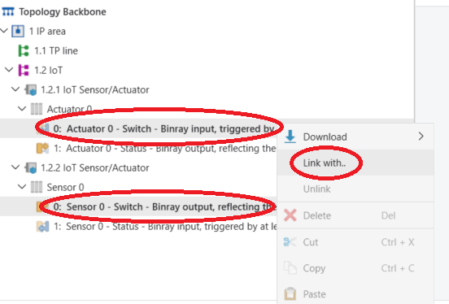

In the newly opened window, you should see the already configured group addresses. You can also configure the current linking by changing the group address. Press `Create & Link` to finish creating the first group address link.

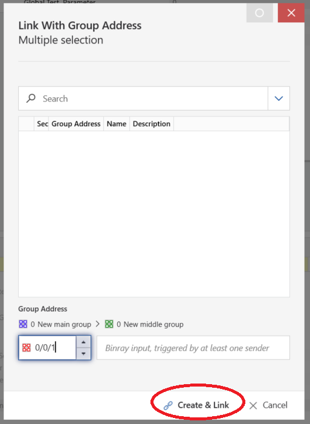

Repeat the same steps for the `0: Actuator 0 - Status` and `0: Sensor 0 - Status` rows. In the end, you should have two group address links for the corresponding channels, `0/0/1` for `Switch` and `0/0/2` for `Status`, as shown in the `Group Addresses` panel.

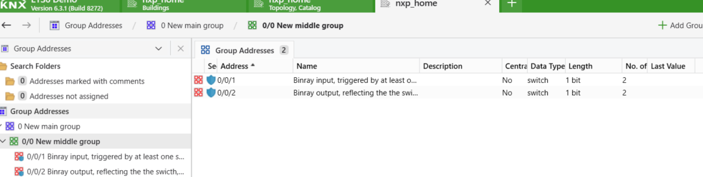

To download the new configuration to each device, in the `Topology Backbone` panel, right click each device and select `Download`->`Download Application`. Wait for the download to finish for each device and check the linking between the devices by pressing the corresponding channel button on the sensor board and watch the corresponding channel LED toggle on the actuator board.

The table below maps the device application configurations to their respective hardware configurations on NXP platforms:

| Device Application | Serial Number | Number of Actuators | Number of Sensors | KNX IoT HW I/O             | Programming button |
|--------------------|---------------|---------------------|-------------------|----------------------------|--------------------|
| FRDM-RW612 LSAB    | 00FABEEF0901  | 1                   | 0                 | LED D2 RGB Green channel   | SW2/WAKEUP button  |
| FRDM-RW612 LSSB    | 00FABEEF0902  | 0                   | 1                 | SW2/WAKEUP button          | SW2/WAKEUP button  |
| FRDM-MCXW72 LSAB   | 00FABEEF0901  | 1                   | 0                 | Blue LED D14               | SW2/PB WU button   |
| FRDM-MCXW72 LSSB   | 00FABEEF0902  | 0                   | 1                 | SW2/WAKEUP button          | SW2/PB WU button   |

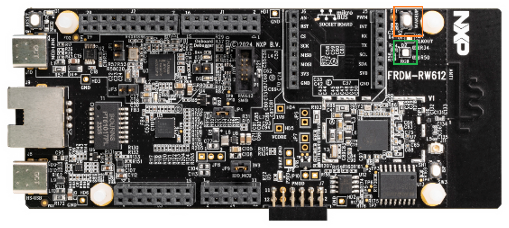

FRDM-RW612 Board

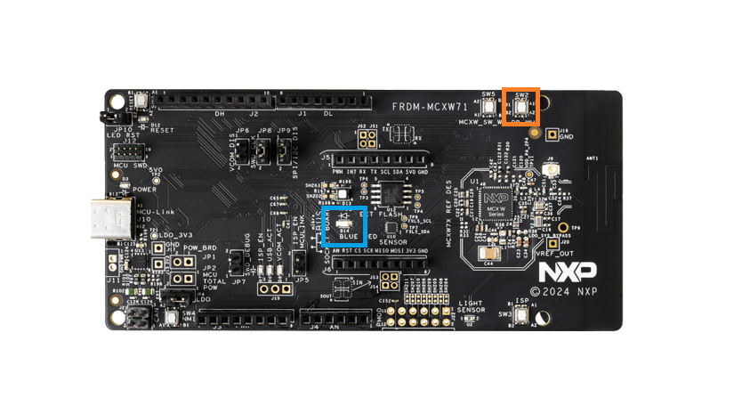

FRDM MCXW72 Board