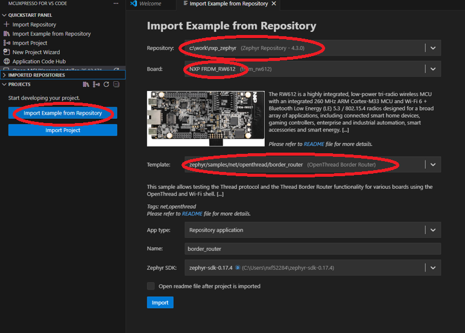
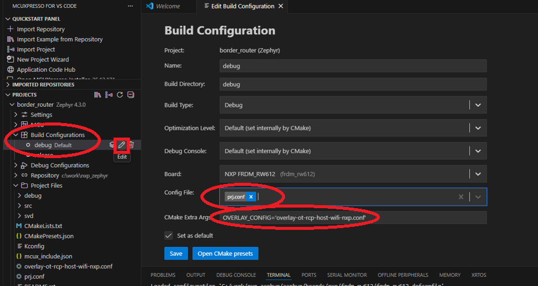

# OpenThread Border Router (OTBR)

OpenThread Border Router enables Thread devices to connect to other networks (Wi-Fi or Ethernet) and communicate with non-Thread devices. The Zephyr OTBR implementation provides full IPv6 routing capabilities between Thread and external networks.

An available Zephyr OTBR is [NXP RW612](https://www.nxp.com/design/design-center/development-boards-and-designs/FRDM-RW612), supporting both Wi-Fi and Ethernet connectivity options.

## Wi-Fi OTBR

- Connects Thread network to Wi-Fi infrastructure
- Provides IPv6 routing between Thread and Wi-Fi

## Ethernet OTBR

- Connects Thread network to Ethernet infrastructure
- Provides IPv6 routing between Thread and Ethernet

## Building OTBR

### Using VS Code Zephyr sample application for OpenThread border router

This way assumes that you have already set up VS Code with Zephyr extension as described in [NXP's Getting started with Zephyr guide](https://www.nxp.com/document/guide/getting-started-with-zephyr:GS-ZEPHYR). The latest Zephyr SDK is recommended to be used. OTBR support in Zephyr is available from version 4.3 onwards.

First, go to `Projects` panel and click on `Import example from repository`.



Select the previously downloaded Zephyr SDK and the FRDM-RW612 board. Select the template for the application `zephyr/samples/net/openthread/border_router`.
Select the available `Zephyr SDK` as `zephyr-sdk-0.17.4`. Select `App type` to desired type: `repository`, `freestanding` or `workspace`.

In the newly added project from the `Projects` panel, select the build configuration and edit the following:

- `Config File` : prj.conf
- `CMake Extra Args` : “OVERLAY_CONFIG='overlay-ot-rcp-host-wifi-nxp.conf’”



Save the configuration and build the project (highlighted red square in picture below).


Debugging can be done using J-Link debugger by clicking the `play` icon (highlighted green square in the picture above).

### Using Command Line

To build from command line, use the following command, assuming building a repository application:

```bash
west -v build -b frdm_rw612 zephyr/samples/net/openthread/border_router -- -DOVERLAY_CONFIG='prj.conf;overlay-ot-rcp-host-wifi-nxp.conf'
```

**Running the OTBR firmware**

After flashing the chosen firmware on the FRDM-RW612 board, user needs to open a serial interface connection with a baud rate of `115200 bps` through a serial terminal such as Putty, TeraTerm or MobaXterm.

Check that the device runs by pressing enter and checking the appearance of `uart:~$` prompt in the terminal.

To connect the OTBR to the Ethernet/Wi-Fi network, the following commands need to be issued in the CLI:

- First connect to the home/building network.

#### For Wi-Fi OTBR firmware

Enter the SSID and PASSWORD of the Wi-Fi AP used for testing.
```bash
wifi connect -s <SSID> <PASSWORD>
```
Await for the Wi-Fi to be connected

### For Ethernet OTBR firmware

Connect the Ethernet cable to the FRDM-RW612 Ethernet port. The cable needs to be connected to a LAN port from the AP.

- Then bring up the Thread network. In the CLI, issue the following commands:
```bash
ot dataset init new
ot dataset channel 26
ot dataset networkkey deadbeefdeadbeefdeadbeefdeadbeef
ot dataset meshlocalprefix fd00:db8::
ot dataset panid 0x1212
ot dataset commit active
ot prefix add fd11:22::/64 pasor
ot ifconfig up
ot thread start
ot dataset active -x
ot ipmaddr add ff05::fd
```

These commands initialize a Thread network with the OTBR as Thread leader, with specific network parameters such as 15.4 channel, network key, PAN ID, etc. The command `ot ipmaddr add` also sets the OTBR to listen for multicast address `ff05::fd` used by ETS in device discovery.

The `ot dataset active -x` command prints a HEX string that needs to be used to commission the other Thread devices to the Thread network. An example of string that can be printed is `0e08000000000001000035060004001fffe00708fdb30c07690192f70c0402a0f7f802088f174af259ceb7f40510deadbeefdeadbeefdeadbeefdeadbeef01021212000300001a03084e58502d4f5442520410a27ef02769739692ecc9581becb2b5f2`. This is just an example, user needs to use the string printed by the device at runtime.


